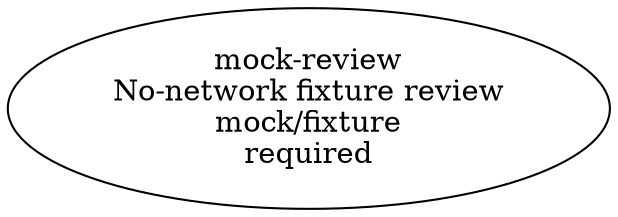

# TeamLoop

<picture>
  <source media="(prefers-color-scheme: dark)" srcset="brand/assets/teamloop-horizontal-dark.png">
  <source media="(prefers-color-scheme: light)" srcset="brand/assets/teamloop-horizontal-light.png">
  
</picture>

**One conversation. A deliberately small team. Evidence before agreement.**

TeamLoop is a local orchestration toolkit for using multiple AI subscriptions and optional specialist providers from a Codex-led workflow. It helps the lead decide when another model is worth involving, send it a focused brief, preserve what happened, and verify the useful parts before changing the project.

Created by **Mark Salisbury with Codex**. Inspired by [Claudex Loop](https://github.com/chaseai-yt/claudex-loop), implemented as a separate system. The starting question was practical: how do I use the subscriptions I already pay for without becoming the human API between three chat windows?

This is a **public preview**, extracted from a working personal setup. The portable core is tested with local fixtures. Live provider compatibility must be checked for your own account, CLI version, and platform. It is not a universal model leaderboard, a new chat app, or a claim of guaranteed token savings.

## What is it, actually?

| Part | What it does | What it is made of |
| --- | --- | --- |
| Control room | You talk to the lead; the lead owns the final decision | Your Codex conversation |
| Skill | Tells the lead how to scope, route, brief and adjudicate | A short Markdown instruction file and operating reference |
| Router | Suggests an eligible worker for each requested role | Deterministic JavaScript plus your JSON roster |
| Execution plan | Freezes dependencies, failure behavior and concurrency before dispatch | Strict versioned JSON with typed review stages |
| Runner | Starts a bounded job and checks its delivery | Local Node.js scripts and provider adapters |
| Shared context | Gives reviewers the same selected evidence | Hashed JSON packets, not a hidden shared brain |
| Receipts | Keeps attempts, lifecycle events, outputs, timings and failures | Local files, not a hosted database |

The lead does the judgment. The runner does the plumbing. Your existing provider software still performs the model call. Nothing in this repo runs continuously in the background.

```text
Your request in Codex
  -> Lead scopes the task and runs useful deterministic checks
  -> Router recommends a small team from your configured roster
  -> A typed execution plan freezes dependencies and failure behavior
  -> Runner sends frozen evidence packets and records lifecycle events
  -> Lead checks findings, resolves disagreements and edits the project
  -> You get the result, material contributions and verification limits
```

## Why bother?

Some jobs need a different eye. Some need a narrow code review. Some need adversarial questions before an expensive build. Others need one local test and no additional model at all.

TeamLoop supports parallel work across providers, independent verification, and smaller context handoffs. Those can improve throughput and reduce redundant reading. They can also add coordination cost. The useful test is whether the team helped finish the job better, not whether more models appeared in the transcript.

You can request a red team for any scoped task. That does not make the result correct. Each important finding still needs evidence, and the lead still has to make the call.

## Try it without accounts

Use Node.js 22 or newer. Clone this repository, open its folder, and run:

```sh
git clone https://github.com/thebeefasaurusrex/teamloop.git
cd teamloop
node --test
node scripts/demo.mjs
node scripts/check-release.mjs
```

There are **no runtime dependencies to install** and these commands make **no model or authentication calls**. The demo freezes a real example packet, runs one typed execution plan through a local mock worker, validates the structured response, and saves the plan, lifecycle events, and worker record in a printed temporary directory. It intentionally returns a blocked review: the plumbing worked, but no AI actually reviewed the task. The demo directory is retained for inspection. Test fixtures are removed when the suite finishes unless you set `TEAMLOOP_KEEP_FIXTURES=1`.

The same three commands run in CI on Linux, macOS and Windows with Node 22 and 24, alongside a Prettier formatting check.

### What a run looks like

The demo produces three kinds of receipt. First, the plan, viewable before dispatch as Graphviz DOT:



Second, the NDJSON lifecycle ledger written to stdout and retained under `plan-runs/<plan-run-id>/events.ndjson`. It carries identifiers and outcomes, never packet contents or prompts:

```json
{"schemaVersion":1,"timestamp":"2026-09-22T02:32:55.321Z","planRunId":"44f3bed2-…","taskId":"demo-plan","event":"run_started","policyVersion":"demo-1","planHash":"f9cdd881…","maxConcurrency":1,"stageCount":1}
{"schemaVersion":1,"timestamp":"2026-09-22T02:32:55.322Z","planRunId":"44f3bed2-…","taskId":"demo-plan","event":"stage_started","stageId":"mock-review","provider":"mock","model":"fixture","effort":"default","failureMode":"required"}
{"schemaVersion":1,"timestamp":"2026-09-22T02:32:55.426Z","planRunId":"44f3bed2-…","taskId":"demo-plan","event":"stage_finished","stageId":"mock-review","status":"completed","workerRunId":"36a9f846-…","packetHash":"923ad83b…","verdict":"blocked"}
{"schemaVersion":1,"timestamp":"2026-09-22T02:32:55.432Z","planRunId":"44f3bed2-…","taskId":"demo-plan","event":"run_finished","status":"completed","elapsedMs":114,"leadDecisionRequired":true,"stages":[{"id":"mock-review","status":"completed","workerRunId":"36a9f846-…"}]}
```

Third, the worker's structured output, validated against a schema bound to the packet hash and saved as `runs/<worker-run-id>/review.json`. A real reviewer returns `approve`, `revise` or `blocked` with evidence-backed findings; the fixture returns the honest answer for a run where no model was called:

```json
{
  "packetHash": "923ad83b3928be2e7296ed1cca57ff7d6bafe6f48e8be60e228279c5ace38e5c",
  "verdict": "blocked",
  "summary": "The runner delivered this fixture successfully. A real review has not happened.",
  "findings": [],
  "uncertainties": ["No model was called. The lead must perform or commission a real review."]
}
```

## Use it from Codex

Install the self-contained skill:

```sh
node scripts/install-skill.mjs
```

By default this targets the `team-loop` folder in your Codex skills directory. **It refuses to overwrite an existing installation.** For a safe trial, use `--dest` with an explicit new folder. Load that skill in your Codex environment according to its local skill-discovery behavior. Installation does not log in or alter provider settings.

Copy `config/providers.example.json` to a private `.local.json` file and configure only the providers you intend to use. All real providers ship disabled. Add verified model IDs and reasoning efforts to their allowlists. Copy the example roster to another `.local.json` file and choose the models for your roles. Account access, remaining capacity, and subscription entitlements are not inferred from a brand name.

Then ask naturally:

> Use TeamLoop to review this feature. Run the existing checks first. Bring in an independent reviewer if the remaining risk warrants it. Keep the team to two workers, show me what they caught, and you make the final call.

On first use, give the lead your private config and roster paths. After that, you should not need a spellbook of model invocations. The exact commands, setup gates and recovery steps live in the [operating reference](skills/team-loop/references/operations.md).

## Inspect a team run before dispatch

TeamLoop execution plans are a narrow orchestration contract for already prepared review packets. They are not generic task-runner files. A plan may name review stages, dependencies, a concurrency ceiling, and whether a failed review is required or advisory. It cannot contain shell commands, remote imports, automatic retries, fallback providers, or worker-authored actions.

```sh
node src/team-loop.mjs plan validate <plan.json> config/my.local.json
node src/team-loop.mjs plan show <plan.json> config/my.local.json
node src/team-loop.mjs plan graph <plan.json> config/my.local.json
node src/team-loop.mjs plan run <plan.json> config/my.local.json
node src/team-loop.mjs plan status config/my.local.json
```

`plan run` writes schema-versioned NDJSON lifecycle events to stdout and retains the resolved plan, status, and event ledger under the configured state directory. Events identify stages and worker run records without copying packet contents, prompts, raw provider output, credentials, or account identities. Completed execution means the configured worker stages reached terminal states. The lead still has to inspect the reviews, adjudicate disagreements, and decide whether anything should change.

## Bring your own lineup

Roles, model IDs, efforts, account allowlists, availability and run budgets are configuration. No particular model generation is the product. The example role choices are teaching examples, not performance rankings.

Included preview adapters connect to Codex CLI, Claude Code CLI, Gemini through Antigravity CLI, and NVIDIA's API. Provider-specific authentication and protocol details still require maintenance. Adding a model to a supported transport is configuration; adding a new transport requires an adapter and tests. A chat subscription does not automatically entitle you to API calls.

The lead can also use its existing local tools before dispatch. This public release does **not** install the author's whole toolbox, remote machines, personal policies, browser sessions, or private model evaluations.

## Temporary Claude Bridge

Standard mode remains canonical. Claude Bridge is an explicitly activated, expiring execution overlay, not a routing-policy rewrite.

When active, the builder receives an exact base commit and a selected file list, works inside a detached Git worktree, and cannot commit, push, deploy, browse, use shell commands, use MCP, or spawn subagents. Deterministic verification runs outside Claude, and the resulting candidate stays unpromoted pending lead review. Invalid, disabled, unvalidated, changed-policy, or expired mode state all resolve back to standard.

These controls bound the runner. They are not a universal security sandbox. See the [operating reference](skills/team-loop/references/operations.md) for activation, builder-spec and rollback commands.

## Evidence and testing

- [Field study and interactive build examples](https://frontier-model-routing-field-notes.netlify.app/): the personal experiment that informed the workflow, with limitations and attempt-level evidence.
- [Evaluation kit](evals/README.md): a reusable protocol, fresh public example, attempt format and summary script. It does not reproduce private historical prompts or import old rankings into your roster.
- `tests/`: software regression checks for the runner, configuration, routing, provider decoders, shared guards and isolated installation. They run in GitHub Actions on Linux, macOS and Windows. These are not evidence that one model is better than another.
- [Release status](docs/RELEASE_STATUS.md): what has and has not been verified in this portable edition.

## Guardrails and limits

Explicit file selection, hashes, account checks, time/output caps, restricted worker invocations, no silent retries, no automatic paid fallback, and retained failures are built into the workflow. Model context is passed deliberately, not synced by scraping your chats.

These controls are **not a universal sandbox**. Secret detection is incomplete. Images need human privacy review. Generated HTML is untrusted active content, not safe just because it passed format validation. Provider-specific restrictions may change. Raw local logs can still be sensitive. Read [SECURITY.md](SECURITY.md) before connecting real accounts.

## Project and release

The system and a reusable evaluation method belong here. The linked site carries the historical case study. Your own accounts, current model roster, raw runs and private task data stay local.

TeamLoop software is licensed under [Apache 2.0](LICENSE). Copyright 2026 Mark Salisbury. The [NOTICE](NOTICE) records the project's attribution. Distributed copies and derivatives must meet the license's notice requirements; this is not a mandatory homepage badge or a royalty arrangement.

The [brand reference kit](brand/README.md) includes logo assets, fonts, exact design values and copy-ready AI instructions. Download the folder and open `brand/index.html` for the visual guide. Font files retain their own OFL licenses; the kit's [license separation note](brand/licenses/README.md) does not grant a new public artwork or trademark license.

See [ACKNOWLEDGMENTS.md](ACKNOWLEDGMENTS.md) for provenance and [CONTRIBUTING.md](CONTRIBUTING.md) for contribution expectations. The repository is [thebeefasaurusrex/teamloop](https://github.com/thebeefasaurusrex/teamloop). This remains a public preview, not a finished cross-platform product. See the [publication checklist](docs/PUBLISHING.md) and [release status](docs/RELEASE_STATUS.md).
